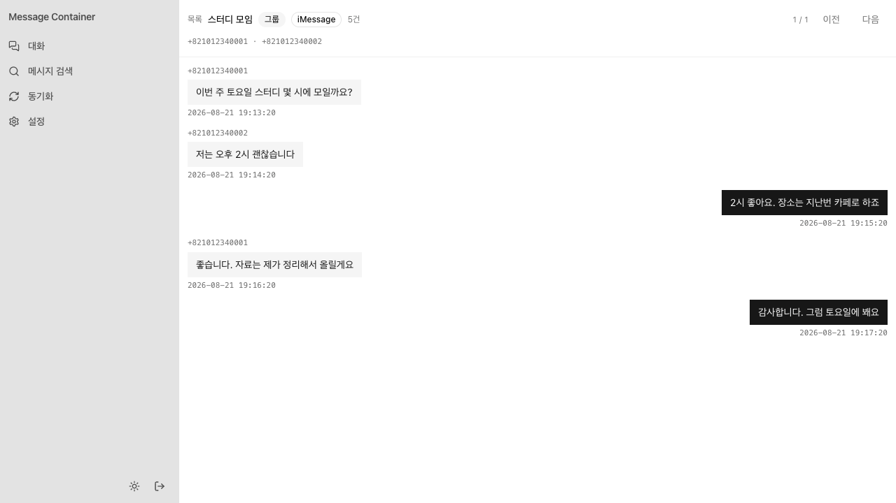

# Message Container

macOS 의 Messages(chat.db)를 읽어 웹 대시보드 · REST API · MCP 로 제공하는 셀프호스팅 Docker 스택.



## 소개

- `~/Library/Messages` 를 읽기 전용으로 마운트해 대화·메시지·첨부파일을 자체 DB(MySQL 기본 · SQLite · PostgreSQL)에 주기적으로 증분 동기화합니다. 조회 전용이며 발송 기능은 없습니다.
- 웹에서 대화를 말풍선으로 읽고 본문을 검색할 수 있으며, 같은 상대의 SMS·iMessage 대화는 하나로 병합됩니다.
- 모든 API 는 웹에서 발급하는 `msg_` API 키로 보호되고, AI 클라이언트(Claude Code 등)는 같은 키로 `/mcp`(Streamable HTTP)에 접속해 대화·메시지·첨부를 조회할 수 있습니다.

## 사용법

1. Docker Desktop(또는 OrbStack)에 Full Disk Access 를 부여합니다 — 시스템 설정 → 개인정보 보호 및 보안 → 전체 디스크 접근 권한.
2. 기동합니다.

    ```bash
    ./scripts/smoke-test.sh
    ```

3. `http://localhost:32000` 에서 초기 패스워드를 설정하면 바로 대시보드가 열립니다. API 키 발급과 MCP 연결 명령은 설정 화면에서 복사할 수 있습니다.

상세 절차는 [docs/setup.md](./docs/setup.md), API 스펙 [docs/api.md](./docs/api.md), MCP 가이드 [docs/mcp.md](./docs/mcp.md), 내부 구조 [docs/architecture.md](./docs/architecture.md) 참고.
